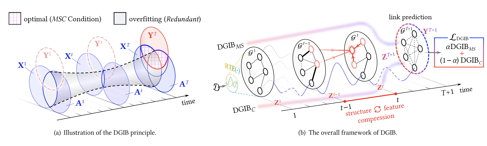

# [WWW 2024] Dynamic Graph Information Bottleneck (DGIB)

This repository is the official implementation of "[Dynamic Graph Information Bottleneck (DGIB)](https://openreview.net/forum?id=j3jFiUQZvH)" accepted by the research tracks of The Web Conference 2024 (WWW 2024).

[](https://openreview.net/forum?id=j3jFiUQZvH)
<p align="center">
  <a href="https://github.com/RingBDStack/DGIB/blob/main/LICENSE"></a> &nbsp; &nbsp;
  <a href="https://github.com/ambv/black"></a> &nbsp; &nbsp;
   &nbsp; &nbsp;
  
</p>

------

## 0. Abstract

Dynamic Graphs widely exist in the real world, which carry complicated spatial and temporal feature patterns, challenging their representation learning. Dynamic Graph Neural Networks (DGNNs) have shown impressive predictive abilities by exploiting the intrinsic dynamics. However, DGNNs exhibit limited robustness, prone to adversarial attacks. This paper presents the novel ***D***ynamic ***G***raph ***I***nformation ***B***ottleneck (***DGIB***) framework to learn robust and discriminative representations. Leveraged by the Information Bottleneck (IB) principle, we first propose the expected optimal representations should satisfy the *Minimal-Sufficient-Consensual (MSC)* Condition. To compress redundant as well as conserve meritorious information into latent representation, DGIB iteratively directs and refines the structural and feature information flow passing through graph snapshots. To meet the *MSC* Condition, we decompose the overall IB objectives into DGIB<sub>*MS*</sub> and DGIB<sub>*C*</sub>, in which the DGIB<sub>*MS*</sub> channel aims to learn the minimal and sufficient representations, with the DGIB<sub>*C*</sub> channel guarantees the predictive consensus. Extensive experiments on real-world and synthetic dynamic graph datasets demonstrate the superior robustness of DGIB against adversarial attacks compared with state-of-the-art baselines in the link prediction task. To the best of our knowledge, DGIB is the first work to learn robust representations of dynamic graphs grounded in the information-theoretic IB principle.

## 1. Requirements

Main package requirements:

- `CUDA == 10.1`
- `Python == 3.8.12`
- `PyTorch == 1.9.1`
- `PyTorch-Geometric == 2.0.1`

To install the complete requiring packages, use the following command at the root directory of the repository:

```setup
pip install -r requirements.txt
```

## 2. Quick Start

### Training

To train DGIB, run the following command in the directory `./scripts`:

```train
python main.py --mode=train --use_cfg=1 --attack=<attack_mode> --distribution=<dis_name>  --dataset=<dataset_name>
```

### Evaluation

To evaluate DGIB with trained models, run the following command in the directory `./scripts`:

```eval
python main.py --mode=eval --use_cfg=1 --attack=<attack_mode> --distribution=<dis_name>  --dataset=<dataset_name>
```

Please put the trained model in the directory `./saved_model`. We have already provided the pre-trained models for all settings. Note that, the model under evasive adversarial attacks is trained on the clean dataset and tested on the evasive attacked data, so the pre-trained model parameters are the same as models trained on the clean datasets in `./saved_model/original_evasive`.

#### Explanations for the arguments:

- `mode`: train the model, or directly evaluate with saved parameters.
- `use_cfg`: if training with the preset configurations. 
- `attack_mode`: adversarial attacking modes, including "random", "evasive", and "poisoning".
- `dis_name`: DGIB versions, including "Bernoulli" for DGIB-Bern and "categorical" for DGIB-Cat.
- `dataset_name`: name of the datasets, including "collab", "yelp", and "act".

#### Configurations for `dataset_name` under different attacking modes
- Non-targeted adversarial attack: `dataset_name` is chosen from "collab", "yelp", and "act" (We report results simultaneously for "Clean", "Structure Attack" and "Feature Attack").
- Targeted adversarial attack (evasive): `dataset_name` is chosen from "collab_evasive_1", "collab_evasive_2", "collab_evasive_3", "collab_evasive_4", "yelp_evasive_1", "yelp_evasive_2", "yelp_evasive_3", "yelp_evasive_4", "act_evasive_1", "act_evasive_2", "act_evasive_3", "act_evasive_4".
- Targeted adversarial attack (poisoning): `dataset_name` is chosen from "collab_poisoning_1", "collab_poisoning_2", "collab_poisoning_3", "collab_poisoning_4", "yelp_poisoning_1", "yelp_poisoning_2", "yelp_poisoning_3", "yelp_poisoning_4", "act_poisoning_1", "act_poisoning_2", "act_poisoning_3", "act_poisoning_4".

### Reproductivity

To reproduce the main results, we have already provided experiment logs in the directory `./logs/history`. 

## 3. Citation
If you find this repository helpful, please consider citing the following paper. We welcome any discussions with [yuanhn@buaa.edu.cn](mailto:yuanhn@buaa.edu.cn).

```bibtex
@inproceedings{yuan2024dynamic,
  title={Dynamic Graph Information Bottleneck},
  author={Yuan, Haonan and Sun, Qingyun and Fu, Xingcheng and Ji, Cheng and Li, Jianxin},
  booktitle={The Web Conference 2024},
  year={2024},
  url={https://openreview.net/forum?id=j3jFiUQZvH}
}
```

## 4. Acknowledgements

Part of this code is inspired by Tailin Wu et al.'s [GIB](https://github.com/snap-stanford/GIB) and Yaxin Li et al.'s [DeepRobust](https://github.com/DSE-MSU/DeepRobust). We owe sincere thanks to their valuable efforts and contributions.
